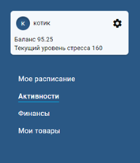

# Part4

Разработка информационной системы на основе
созданной базы данных(см. курсовая работа часть 3).

Для начала работы

npm install

npm run start

Описание системы. Руководство пользователя
1. Регистрация 

При первом входе в систему придумайте логин и пароль и введите их в соответствующие поля формы, а затем нажмите на кнопку «Создать аккаунт».
 

2. Завершение регистрации. 

Баланс и максимальный уровень стресса
Для завершения регистрации заполните поля «Максимальный уровень стресса»* и «Баланс»** (рис. а). При необходимости вы сможете изменить заданные значения позднее в настройках приложения. Это шаг можно пропустить, тогда будут установлены значения по умолчанию: 600 для максимально допустимого уровня стресса и 0 для баланса (рис. б). 

рис. а	   

  
  
рис. б
	
Баланс* — текущая сумма денежных средств, которыми вы располагаете, она будет изменятся при добавлении новых статей расходов и доходов. 
Максимально допустимый уровень стресса** — каждая активность влияет на ваш уровень стресса: когда вы занимаетесь чем-то сложным и неприятным, он повышается, интересные занятия и отдых понижают его. Система генерирует расписание дня из добавленных вами активностей таким образом, чтобы текущий уровень стресса не превышал максимальный.
За текущим состоянием баланса и максимального уровня стресса можно наблюдать в окошке в боковом меню.
 

3. Авторизация

Если вы уже были зарегистрированы в системе введите логин и пароль и нажмите кнопку «Войти» для входа.
 

4. Активности

Для формирования расписания необходимо заполнить информацию об активностях, которые вы планируете совершить. Они могут быть периодическими и непериодическими.
 
 
 
Чтобы добавить новую активность, нажмите на кнопку «Новая запись» в верхнем правом углу экрана, заполните появившуюся перед вами форму необходимой информацией и нажмите кнопку «Добавить».
Добавление непериодической активности

Добавление периодической активности
 

В зависимости от типа активности появляются дополнительные параметры:
 
●	для похода в магазин — выбор одного из списков покупок;

●	для учебы — аудитория, преподаватель и тип занятия (лекция или практика);

●	для спорта — тип спортивного занятия (например, йога или пилатес);

●	для любого другого типа активности — его краткое описание.

Их можно посмотреть, наведя мышь на интересующую вас строку:
 

Также можно фильтровать активности  по типу, выбирать только очные, просматривать активности за указанный период, редактировать и удалять их.
 
Для периодических активностей время в колонках «Допустимое время начала» и «Допустимое время конца» — допустимый интервал выполнения внутри суток, даты — период, в течении которого активность должна выполняться (например, вы добавляете активность посещение лекций по Операционным системам, тогда эти поля будут содержать время проведения лекций и даты начала и окончания семестра соответственно).

5. Расписание

На основании добавленных активностей генерируется расписание на заданный день. Подтверждение выполнения активности изменяет ваш текущий уровень стресса. 

Как и в общем списке активностей дополнительную информацию об активности можно получить при наведении на строку таблицы.

6. Финансы

В разделе «Финансы» можно вести учет своих доходов и расходов. При внесении новых статей доходов или расходов ваш баланс будет пересчитан. 

Для добавления новой финансовой операции нажмите кнопку «Новая запись» в верхнем правом углу, заполните появившуюся перед вами форму необходимой информацией и нажмите кнопку «Добавить».

Записи о финансовых операциях можно удалять и редактировать (иконки карандаша и мусорного ведра в строках записей).

7. Мои товары

В разделе «Мои товары» можно формировать и удалять списки покупок, при необходимости редактировать их названия, добавлять, удалять и изменять товары. Для просмотра содержимого списка выберите его название с помощью фильтра на боковой панели.
 

Для добавления нового списка покупок нажмите на кнопку «Новый список» в правом нижнем углу экрана, придумайте и впишите в поле формы его название, и нажмите на кнопку «Добавить».

Также можно отредактировать название уже существующего списка, открыв его и кликнув на название в верхнем правом углу, после чего текст изменится на поле для ввода нового названия. После изменения нажать на иконку карандаша и поле ввода снова станет надписью. 

Для добавления нового товара в список выберите интересующий вас список и нажмите на кнопку «Добавить товар» в нижнем правом углу экрана. Перед вами появится форма, которую нужно заполнить информацией о товаре, а затем нажать кнопку «Добавить».

После совершения покупки подтвердите ее, чтобы система автоматически добавила новую статью расхода и пересчитала ваш баланс.

8. Настройки

Раздел настроек содержит список часто посещаемых мест, вы можете добавить, отредактировать и удалить их, и максимальный уровень стресса, который также можно изменить. 
 

